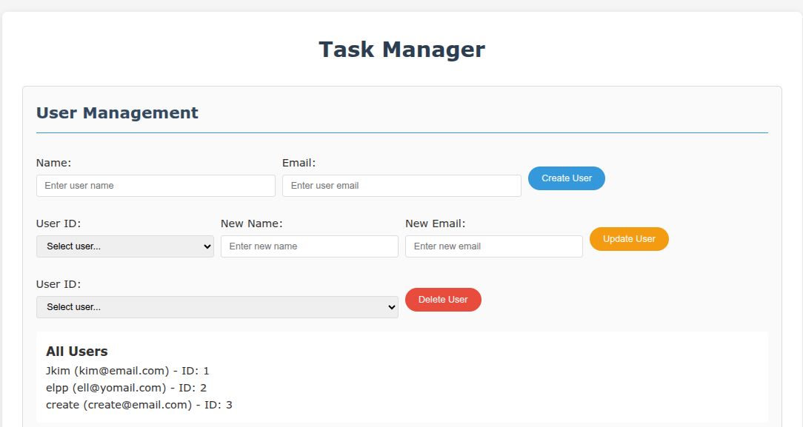

## Task Manager App

A modern, responsive web app built with **HTML**, **CSS**, **JavaScript**, and **TypeScript**. 

This app helps you **manage users and their assigned tasks**, with full **CRUD operations**, **assign/unassign features**.

---

### Screenshots

#### Creating Users


#### All Users



#### Creating Tasks


####  Assign Tasks


---

### Features

* Add, Edit, Delete Users
* Add, Edit, Delete Tasks
* Assign / Unassign users to Tasks
* Success or Error messages after each operation

---

### Tech Stack

* **HTML5**
* **CSS3**
* **JavaScript**
* **TypeScript**

---

### Project Structure

```
/user-task-manager
├── dist/                        # Compiled JavaScript output from TypeScript
│     └── index.js               # Bundled JS logic for the app (from src/index.ts)
│ 
├── node_modules/                # Project dependencies installed via npm
│ 
├── src/                         # Source code directory (TypeScript)
│     └── index.ts               # Main TypeScript logic for app functionality
│ 
├──.gitignore                    # Specifies files/folders to ignore in Git
│ 
├── favicon.ico                  # Favicon used in browser tab
│ 
├── index.html                   # Main HTML file; structure of the web app
│ 
├── package-lock.json            # Auto-generated dependency tree for reproducibility
│ 
├── package.json                 # Project metadata and npm dependencies
│ 
├── README.md                    # Project overview, usage instructions, and documentation
│ 
├── style.css                    # Main CSS file for styling the application
│ 
└── tsconfig.json                # TypeScript compiler configuration

```

### Setup Instructions

1. **Clone the repo:**

   ```bash
   git clone https://github.com/your-username/user-task-manager.git
   cd user-task-manager
   ```

2. **Open `index.html` in your browser; use live-server.**

3. **To modify TypeScript:**

   * Edit `index.ts`
   * Compile using `tsc`:

     ```bash
     tsc index.ts
     ```

---
